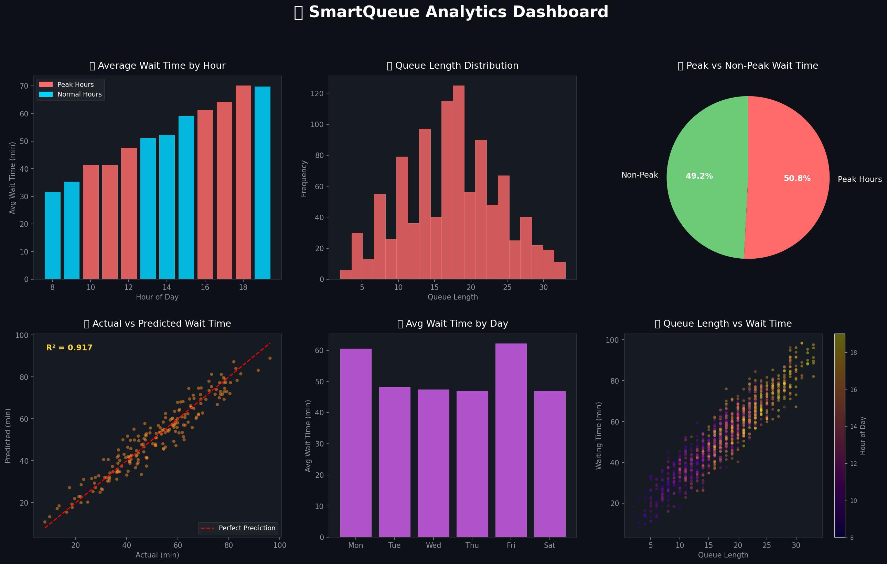

# 🚦 SmartQueue: Queue Waiting Time Prediction & Analytics


> A data-driven approach to predict queue waiting times and identify peak hours — helping organizations improve service efficiency and customer experience.

---

## 📌 Project Overview

SmartQueue is a machine learning project that predicts **waiting time** in service queues using features like arrival time, day of week, queue length, and service time. It also identifies **peak hours** and provides actionable analytics.

**Real-World Application:** Banks, hospitals, government offices, airports — anywhere queues form.

---

## 🎯 Objectives

- ✅ Predict waiting time using Linear Regression
- ✅ Identify peak and off-peak hours
- ✅ Analyze queue patterns by day and time
- ✅ Visualize insights through a dashboard

---

## 📁 Project Structure

```
SmartQueue_Analytics/
│
├── data/
│   └── smartqueue_dataset.csv        # 1000-row synthetic dataset
│
├── notebooks/
│   └── SmartQueue_Analysis.ipynb     # Full analysis notebook
│
├── outputs/
│   ├── smartqueue_dashboard.png      # Visual dashboard
│   └── model_metrics.csv            # Model performance metrics
│
├── generate_and_run.py               # Standalone script
├── requirements.txt
└── README.md
```

---

## 📊 Dataset Description

| Column | Description |
|--------|-------------|
| `token_id` | Unique token number |
| `arrival_hour` | Hour of arrival (8–19) |
| `arrival_minute` | Minute of arrival |
| `day_of_week` | Day name |
| `queue_length` | People in queue at arrival |
| `service_time` | Time taken to serve (min) |
| `waiting_time` | **Target** — actual wait time (min) |

---

## 🤖 Machine Learning Model

| Parameter | Value |
|-----------|-------|
| Algorithm | Linear Regression |
| Features | 6 (hour, minute, queue, service_time, day, is_peak) |
| Train/Test Split | 80/20 |
| **R² Score** | **~0.917** |
| **RMSE** | **~5 minutes** |

---

## 📈 Key Insights

- 🔴 **Peak hours:** 10–12 AM and 4–6 PM have highest wait times
- 📅 **Busiest days:** Monday and Friday
- 🔗 **Queue length** is the strongest predictor of waiting time
- ✅ Model explains **91.7%** of variance in waiting time

---

## 🚀 How to Run

```bash
# Clone or download the project
cd SmartQueue_Analytics

# Install dependencies
pip install -r requirements.txt

# Option 1: Run the Python script
python generate_and_run.py

# Option 2: Open Jupyter Notebook
jupyter notebook notebooks/SmartQueue_Analysis.ipynb
```

---

## 📦 Requirements

```
pandas
numpy
matplotlib
seaborn
scikit-learn
jupyter
```

---

## 📷 Dashboard Preview



---

## 👤 Author

**Your Name**  
Data Science Enthusiast | Python Developer  
📧 yourmail@email.com | 🔗 [LinkedIn](https://linkedin.com)

---

> ⭐ Star this repo if you found it helpful!
